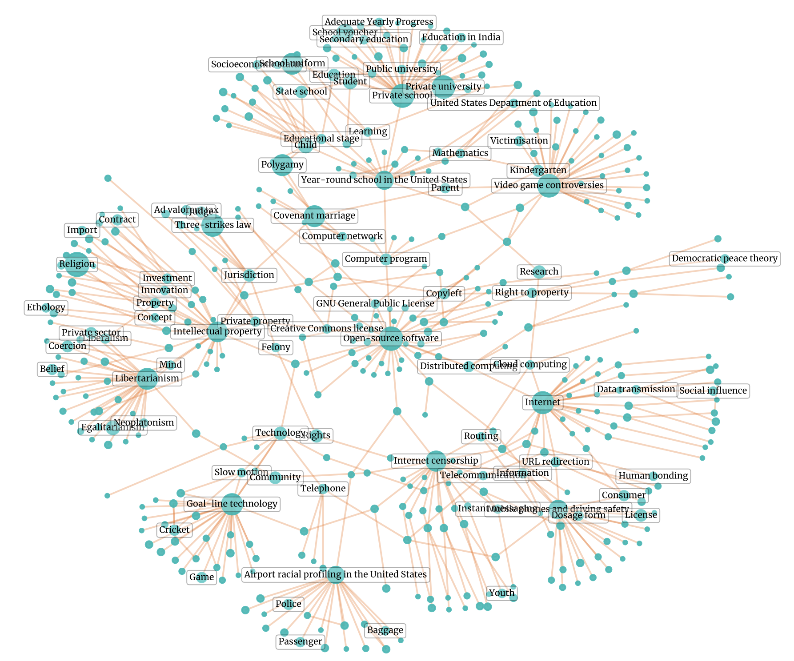
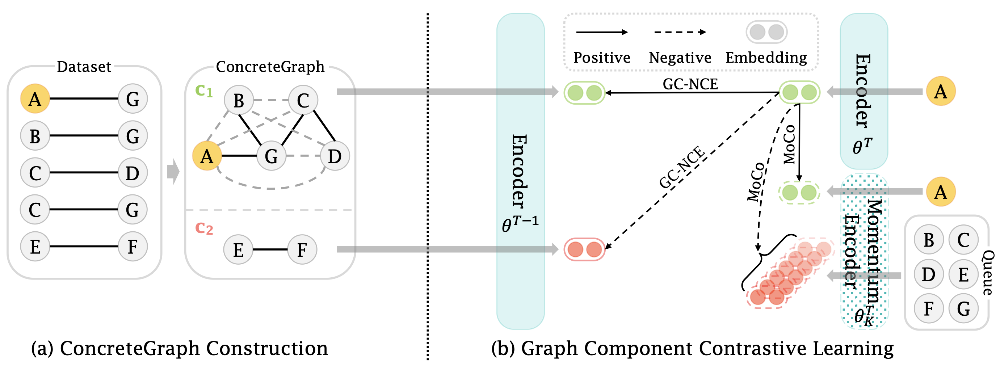

# Graph Component Contrastive Learning
Concept relatedness estimation (CRE) aims to determine whether two given concepts are related. Existing methods only consider the pairwise relationship between concepts, while overlooking the higher-order relationship that could be encoded in a concept-level graph structure. We discover that this underlying graph satisfies a set of intrinsic properties of CRE, including reflexivity, commutativity, and transitivity. In this paper, we formalize the CRE properties and introduce a graph structure named ConcreteGraph. To address the data scarcity issue in CRE, we introduce a novel data augmentation approach to sample new concept pairs from the graph. As it is intractable for data augmentation to fully capture the structural information of the ConcreteGraph due to a large amount of potential concept pairs, we further introduce a novel Graph Component Contrastive Learning framework to implicitly learn the complete structure of the ConcreteGraph. Empirical results on three datasets show significant improvement over the state-of-the-art model. Detailed ablation studies demonstrate that our proposed approach can effectively capture the high-order relationship among concepts.

## ConcreteGraph


## Our Model


## Dependencies
```
scikit-learn
pandas
networkx
transformers
...
```
You can install them with:
```
pip install -r requirements.txt
```

## Datasets
### WORD

The WORD dataset is officially available [HERE](https://developer.ibm.com/exchanges/data/all/wikipedia-oriented-relatedness/). </br>
* WORD : wikipedia-oriented-relatedness/WORD.csv

With the downloaded CSV file, one can scrape Wikipedia document files by running
```
python code/word/download.py
```
In the configuration file [PATH TO CONFIG FILE]
* CSV_PATH : path to WORD.csv
* RAW_DATA_DIR : where the scraped Wikipedia document files are to be stored

### CNSE & CNSS
The CNSE & CNSS datasets are officially available [HERE](https://github.com/BangLiu/ArticlePairMatching/tree/master/data/raw/event-story-cluster). 
* CNSE : same_event_doc_pair.txt 
* CNSS : same_story_doc_pair.txt
There is no need to scrape documents for CNSE and CNSS, as they are already in those two dataset files.

## Usage
To train a model, run:
```
python code/train.py \
    --model=[TRANSFORMER NAME] \
    --config=[PATH TO YAML CONFIG FILE] \
    --split_file=[PATH TO DATA SPLIT JSON FILE] \
    --dataset=[DATASET NAME] \
    --random_seed=42 \
    --batch_size=8 \
    --num_epochs=2 \
    --learning_rate=1e-5 \
    --use_aug \
    --aug_ratio=2 \
    --k_hops=2 \
    --use_gccl \
```

To evaluate a model checkpoint, run:
```
python code/train.py \
    --model=[TRANSFORMER NAME] \
    --load_ckpt=[PATH TO MODEL CHECKPOINT] \
    --config=[PATH TO YAML CONFIG FILE] \
    --split_file=[PATH TO DATA SPLIT JSON FILE] \
    --dataset=[DATASET NAME] \
    --dataset_cache_path=[DATASET CACHE] \
    --batch_size=4 \
    --eval \
```

* --model : BERT, RoBERTa, XLNet are implemented, choose one among the three transformer models
* --load_ckpt : path to the checkpoint file
* --config : a yaml configuration file that specifies dataset file paths, maximum sequence length, model path, etc.
* --split_file : use the provided train, validation, test split; instead, one can also generate a new dataset split with the --new_split option
* --dataset : one of the three dataset names: word, cnse, or cnss
* --use_aug : use ConcreteGraph-based data augmentation method
* --aug_ratio : target augmentation ratio (only effective when --use_aug)
* --k_hops : the maximal number of hops (only effective when --use_aug)
* --use_gccl : use GCCL for the model